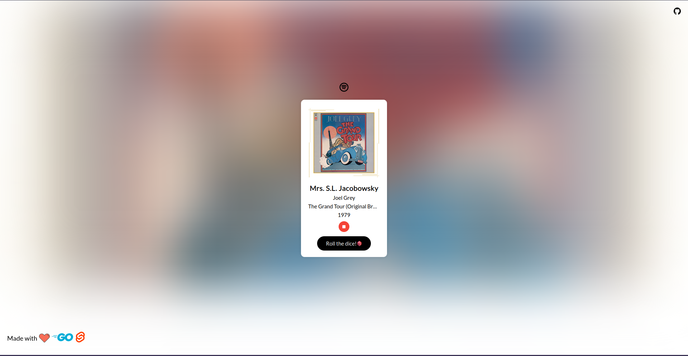
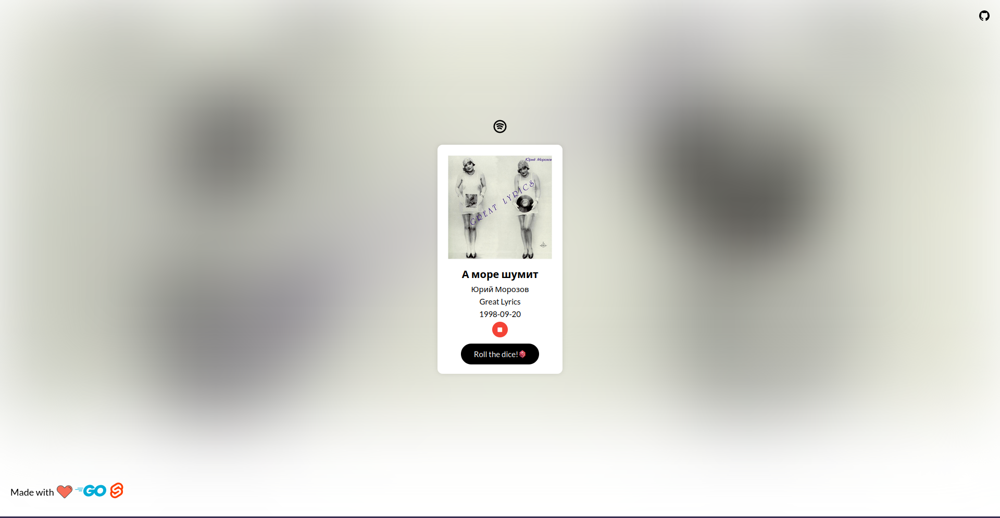

# Muffle

Hi! [Muffle](https://muffle.vercel.app) is a website that gives you a random song across 126 genres and 70 years in less than a second. i made it for music producers for the sake of sampling and music geeks in general.




## Technologies

1.  [Golang](https://go.dev) (Backend)
2.  [Svelte](https://svelte.dev) (Frontend)

### Deployment

The backend is deployed using [Render](https://render.com). And the frontend is deployed using [Vercel](https://vercel.com)

## Running Locally

### Backend

```bash
$ git clone https://github.com/fvrrvg/muffle.git
$ cd muffle/BACKEND
$ go run .
```

##### Secrets (config.env)

```bash
$ CLIENTID=your_spotify_client_id
$ SPOTIFY_SECRET=your_spotify_client_secret
```

##### Endpoint

```http
GET /random
```

### Frontend

```bash
$ cd muffle/FRONTEND
$ npm install
$ npm run dev
```

##### Secrets (.env)

```bash
$ VITE_API_ENDPOINT=backend_endpoint
```

## Contributing

Feel free to open an issue or submit a pull request.

##### Contact Me

If you are a graphic designer who came across muffle and want to help with the logo u can find me through my email here :)

[mohamedfarrag@protonmail.com](mailto:mohamedfarrag@protonmail.com)
